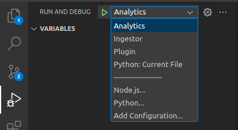

# RuneLite Wrapped


## Basic App Architecture


## Components

* [Plugin](/apps/plugin/README.md)
  * A plugin for RuneLite that sends game data to the ingestor service.
  * Users will need to have this plugin installed in their local RuneLite for us to receive their game data.
  * Written in Java
* [Ingestor](/apps/ingestor/README.md)
  * This is an API that receives the data (via HTTP POST) from the plugin and stores it in a mongoDB instance
  * Written in Python
* [Analytics](/apps/analytics/README.md)
  * This is a collection of data processing pipelines running in a [dagster](https://dagster.io/) instance
  * These pipelines turn the raw game telemetry into useful stats for the Wrapped report
  * Written in Python
* [Webapp](/apps/webapp/README.md)
  * This is the Web App that users will go to to see their Wrapped report
  * Written in TBD

## Repository Structure

Here are the relevant directories for each component:
* The ingestor: `apps/ingestor/`
* The analytics: `apps/analytics/`
* The webapp: `apps/webapp/`
* The plugin: `apps/plugin/`

There is also common python code that can be shared between the ingestor and analytics projects in the `common/` directory.

## Setup

This section will go through all the things needed to get started in this repo. Excluding the Java stuff - that's a WIP.

### Requirements

* A linux machine (WSL2 on windows with ubuntu is fine)
* Python 3.10+
  * With `pip` and `venv` accessible
* Docker (or a mongodb instance running elsewhere)

### Virtual Environment

You should have a virtual environment set up at the root of the repository. This can be done with the following commands:

```bash
python3 -m venv venv
source venv/bin/activate
```

You will also want to configure vscode to use this virtual environment. You can do this by opening the command palette (ctrl+shift+p) and searching for "Python: Select Interpreter". Then select the virtual environment you just created (`./venv/bin/python`). Note: you will need to have the python extension installed for vscode to have this command.

### Environment Variables
### PYTHONPATH

In order to run code that uses the `common` package you'll need to add it to your python path, it's also worth adding the two python projects to the python path also (ingestor, analytics). This can be done by setting the `PYTHONPATH` environment variable to the root of the repository.

For vscode (and many other development environments) you can use a .env file to set environment variables. You can create a file called `.env` in the root of the repository and add the following line to it:

```bash
PYTHONPATH=./common:./apps/ingestor:./apps/analytics
```

The "python path" is a list of directories that python will look in when you try to import a package. You can read more about it [here](https://docs.python.org/3/tutorial/modules.html#the-module-search-path).

### MONGO_URI

The ingestor and analytics apps both require access to a mongodb instance. You can either run one locally or use a docker container. If you want to use a docker container you can run the following command:

```bash
docker run -d -p 27017:27017 --name runelite-wrapped-mongo mongo
```

This will run a mongodb instance in a docker container and expose it on port 27017. You can then set the `MONGO_URI` environment variable to `mongodb://localhost:27017` in your `.env` file.

### TLDR

Here's what your `.env` file should look like:

```bash
PYTHONPATH=./common:./apps/ingestor:./apps/analytics
MONGO_URI=mongodb://localhost:27017
```

MONGO_URI may be different depending on how you're running your mongodb instance.

### Install dependencies

```bash
pip install -r requirements.txt
```

Our dependency setup is a little bit janky at the moment. We're using a single venv for all projects, as monorepo tooling in python is still quite nascent.

We may revisit this in the future, if anything to reduce build times / image sizes.

### Set up your `.vscode/` directory

I've added an example `.vscode/` directory to the repo at `.vscode.example/`. This contains a `launch.json` file that will allow you to run the ingestor and analytics apps from within vscode.

To copy the template (be careful not to overwrite your existing `.vscode/` directory if there is one)

```bash
cp -r .vscode.example/ .vscode/
```
Now in the debug section of vscode you should see two options for running the ingestor and analytics apps.

### Running / Debugging

You can run the ingestor and analytics apps from within vscode by selecting the appropriate option in the debug section.



You can also run them from the command line with the following commands:

```bash
# ingestor
python -m ingestor.main
# equivalent to:
# python apps/ingestor/ingestor/main.py

# analytics
python -m dagster dev -m analytics
```

## Other Stuff
### Relevant Tutorials

I have linked a bunch of relevant tutorials for spooling up/learning python + relevant packages [here](/docs/tutorials/)
